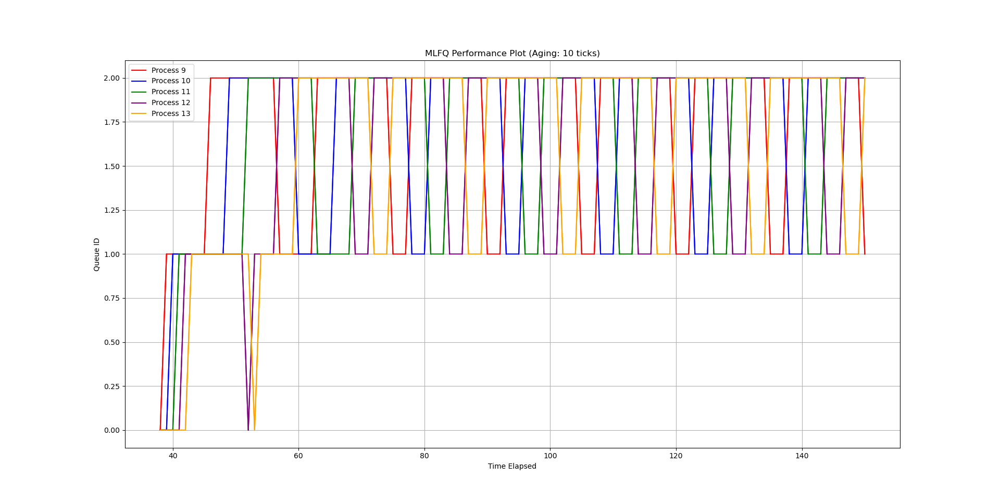
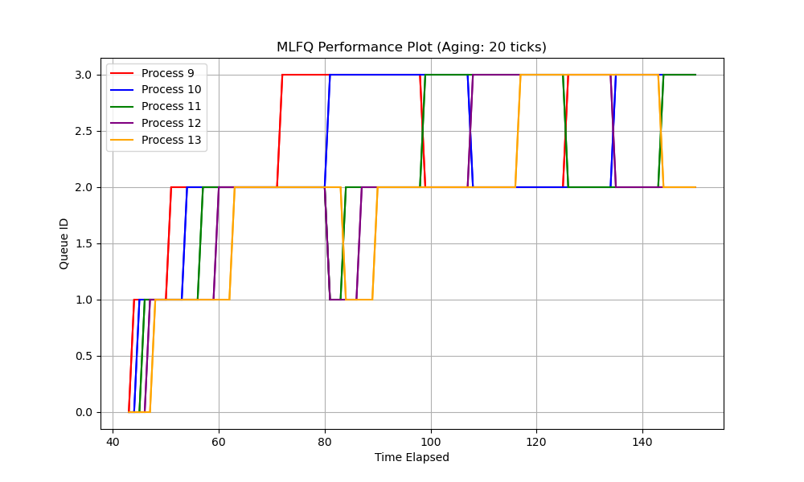
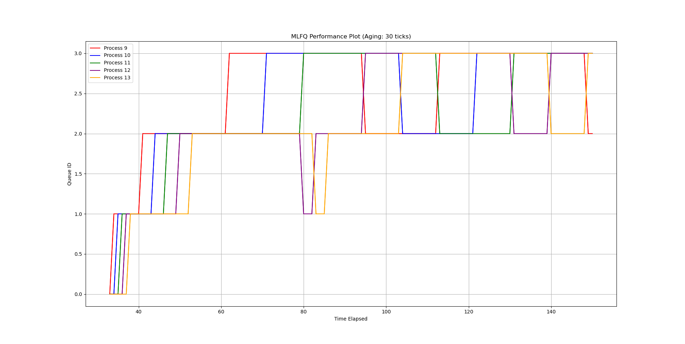
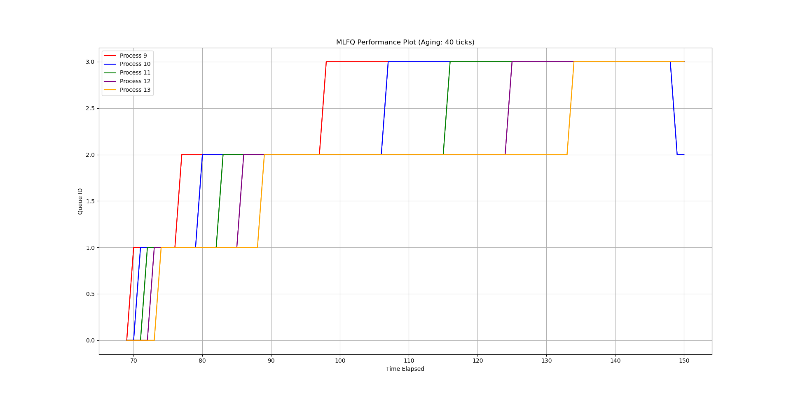
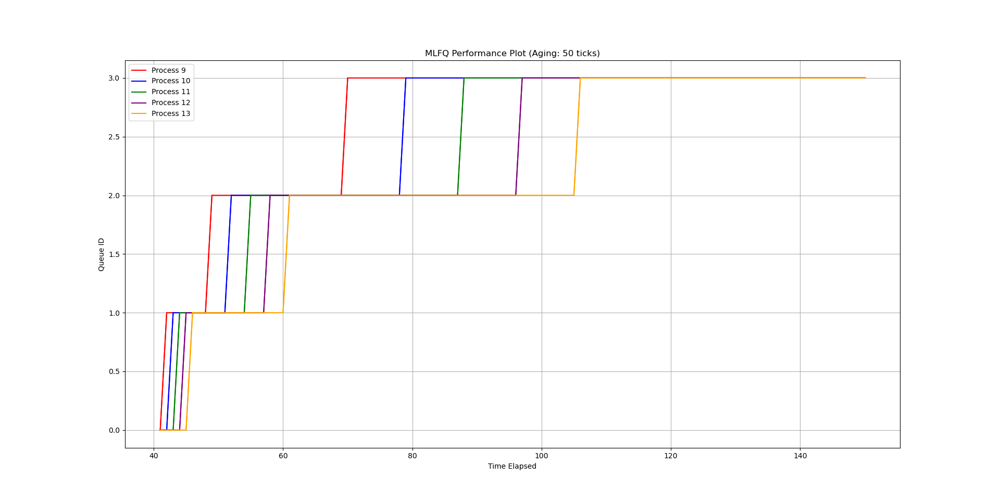
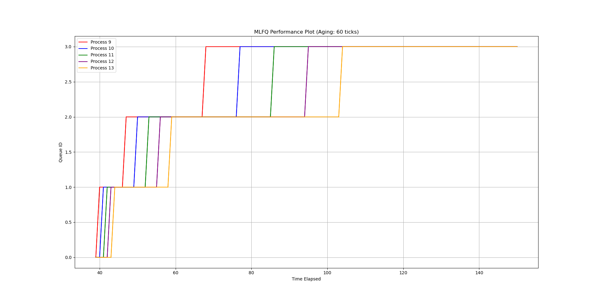

# Process Scheduling in XV6

## First-Come, First-Served (FCFS) Scheduling

### Explanation

The FCFS (First-Come, First-Served) scheduling algorithm is straightforward and operates as follows:

1. **Process Iteration**: The algorithm iterates through the process table, examining each process in sequential order.

2. **Process Selection**: When a runnable process is found, it is marked as "RUNNING," indicating that it is currently executing.

3. **Assignment to CPU**: The process is assigned to the CPU's `proc` field, and a context switch is performed using the `swtch` function.

4. **Execution and Completion**: After execution, the process is marked as not running (`c->proc = 0`).

FCFS schedules processes in the order they arrive, making it simple to understand but potentially leading to poor responsiveness in scenarios with long-running processes.

## Round Robin Scheduling

### Explanation

Round Robin is a time-sharing scheduling algorithm designed for fairness and timesharing. Here's a detailed explanation of how Round Robin operates based on the provided code:

1. **Process Iteration**: Similar to FCFS, the Round Robin algorithm begins by iterating through the process table. It examines each process sequentially.

2. **Process Selection**: When a runnable process is found (indicated by `p->state == RUNNABLE`), it is selected to run next. This process is marked as "RUNNING."

3. **Preemption and Time Slicing**: Round Robin introduces preemption. The selected process is assigned to the CPU's `proc` field (`c->proc = p`), and a context switch is performed. Round Robin schedules processes in a time-sliced manner, ensuring that each process gets a fair share of CPU time.

4. **Fairness**: The preemption and time-slicing mechanisms in Round Robin promote fairness by allowing multiple processes to run in a round-robin fashion. This ensures that no process monopolizes the CPU.

5. **Completion**: After a process completes its time slice or is preempted by another runnable process, it is marked as not running (`c->proc = 0`). The algorithm then proceeds to select the next runnable process in the queue.

Round Robin is particularly well-suited for time-sharing environments, where it ensures that each process receives a fair amount of CPU time. However, the frequent context switches may introduce some overhead.

## Multi-Level Feedback Queue (MLFQ) Scheduling

### Explanation

The Multi-Level Feedback Queue (MLFQ) scheduling algorithm is a dynamic and adaptable approach that combines multiple queues and aging mechanisms. Here's a comprehensive explanation of how MLFQ operates based on the provided code:

1. **Aging and Priority Adjustment**: The MLFQ algorithm starts by implementing an aging mechanism. Processes that have been waiting for a certain period (defined by `AGINGNUM`) are promoted to higher-priority queues. This mechanism prevents starvation by gradually boosting the priority of waiting processes.

2. **Queue Assignment**: Processes are initially assigned to queues based on their priority levels (`numQueue`). Lower-priority queues are typically assigned to processes that have higher time-sharing requirements, while higher-priority queues are for processes requiring immediate execution.

3. **Process Selection**: The algorithm continuously selects the highest-priority runnable process for execution. This selection ensures that processes with the most urgent needs are given precedence.

4. **Fairness and Responsiveness**: MLFQ introduces fairness and responsiveness by dynamically adjusting process priorities. Processes can move between queues based on their behavior and resource requirements. This adaptability makes MLFQ suitable for environments with varying workloads and priorities.

MLFQ is a flexible scheduling algorithm that balances fairness and responsiveness. It prevents starvation through aging, ensures that processes with higher urgency are executed promptly.

## Graphs

### Aging - 10 Ticks

### Aging - 20 Ticks

### Aging - 30 Ticks

### Aging - 40 Ticks

### Aging - 50 Ticks

### Aging - 60 Ticks

## Performance Analysis

In this section, we analyze the performance of the scheduling algorithms based on the provided data. The data includes average running time (rtime) and waiting time (wtime) for different scheduling algorithms with varying numbers of CPUs (in parentheses).

### FCFS Analysis

#### FCFS (1 CPU)

- Average rtime: 35
- Average wtime: 176

#### FCFS (8 CPUs)

- Average rtime: 64
- Average wtime: 100

### Round Robin Analysis

#### RR (1 CPU)

- Average rtime: 35
- Average wtime: 240

#### RR (8 CPUs)

- Average rtime: 50
- Average wtime: 116

### Multi-Level Feedback Queue (MLFQ) Analysis

#### MLFQ (1 CPU)

- Average rtime: 39
- Average wtime: 258

## Conclusion

In conclusion, the analysis of scheduling algorithms based on the provided data highlights the following insights:

- FCFS tends to have shorter rtime but longer wtime, especially when limited to a single CPU. It lacks prioritization, leading to inefficient resource utilization.
- RR provides better parallelism and reduced wtime with more CPUs but may introduce slightly longer rtime due to context switching.
- MLFQ exhibits dynamic behavior with varying rtime and wtime depending on factors like aging and the number of CPUs and runs relatively better than RR and FCFS under limited CPUs as shown in the higher rtime.
- It is important to note that MLFQ's performance with 8 CPUs is not available in the provided data.
